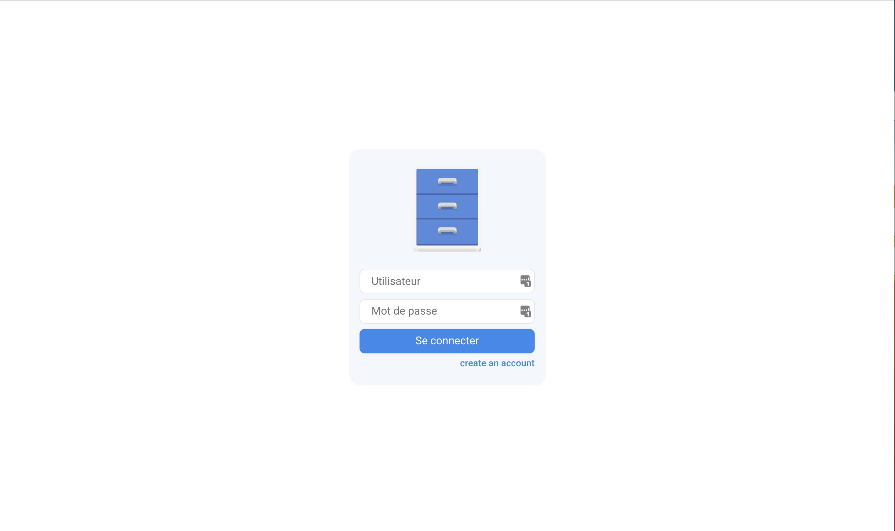
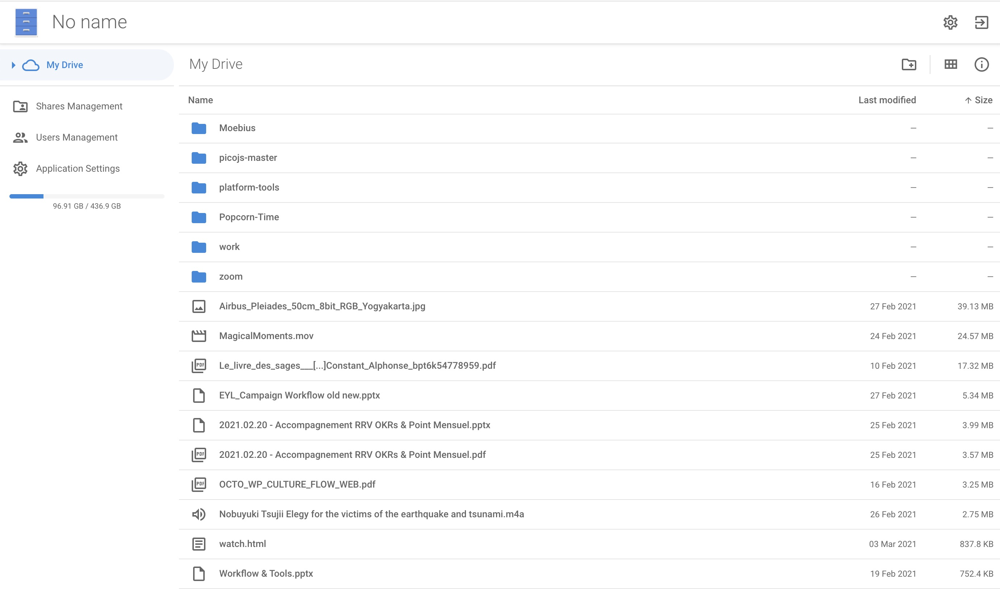

# Lightweight Browser-based File Explorer

A refined and slimmed fork from https://github.com/fchazal/filebrowser.git that aims to provide a nice looking, lightweight and efficient file explorer that could easily be run on Raspberry PI Zero.

Languages used GOLang and VueJS, currently refining the UI after purging some of the code that I don't find useful for my need.

## Material Icons

https://material.io/resources/icons/?style=outline
